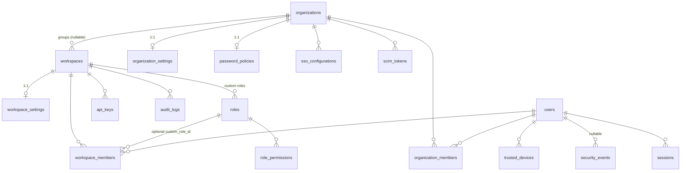

# Enterprise schema — organizations, RBAC, security

The tables Phase 8 added or changed. Authored entirely by Alembic
(ADR-0005); no manual DDL in any environment.

## Entity relationships

## Migrations, in order

| Revision | Adds |
|---|---|
| `f1a2b3c4d5e6` | `organizations`, `organization_members`, `workspaces.organization_id`, `audit_logs.organization_id` |
| `f4b8d1e6c037` | `sso_configurations` |
| `a8c4d1f7b302` | `scim_tokens` |
| `b3f7c1a9e582` | role columns → TEXT + CHECK; `roles`, `role_permissions`; `workspace_members.custom_role_id` |
| `c7a2e91d4b60` | `organization_settings` |
| `d5b3f8c2a916` | `security_events`, `trusted_devices`, `password_policies` |
| `e8c1a4f70d23` | `api_keys.expires_at`, `api_keys.use_count` |

Every one is additive and has a working `downgrade()`, verified
upgrade → downgrade → upgrade against real Postgres (Rule 19).

## Tables

### `roles` / `role_permissions`

Workspace-defined roles. `base_role` anchors to a built-in tier;
`role_permissions` holds only the **extra** grants.

Inherited grants are deliberately not stored. Storing them would freeze
a snapshot of the base tier's matrix at creation time, so a later change
to what `developer` can do would silently not reach custom roles built
on it.

`workspace_members.custom_role_id` is nullable, and the common path
(`NULL`) never touches these tables — `require_permission` has a fast
path that skips the join entirely.

### `organization_settings`

1:1 with `organizations`; the id is both PK and FK. "No row" is the
documented default state, not a missing record.

A separate table rather than columns on `organizations` because the
profile is optional and mostly-null: keeping it 1:1-on-demand means
"never configured" stays readable instead of a row full of NULLs on the
identity table. Mirrors `workspace_settings` exactly.

`custom_domain` is UNIQUE — a domain resolves to exactly one tenant.

### `security_events`

Every scoping column (`user_id`, `workspace_id`, `organization_id`) is
nullable, because the events that matter most arrive before scope is
known. See [`security-architecture.md`](../security/security-architecture.md)
for why this is not `audit_logs`.

Indexes: single-column on each scope and on `event_type`/`severity`,
plus a composite `(user_id, created_at DESC)` — the feed is always read
newest-first for one user, and the composite serves that better than the
single-column index alone.

### `trusted_devices`

Unique on `(user_id, device_fingerprint)`. `CASCADE` from `users`:
deleting an account takes its devices with it.

`revoked_at` rather than a delete, so re-trusting can un-revoke and the
history stays followable.

### `password_policies`

1:1 with `organizations`. `CHECK (min_length >= 8)` — the database
refuses a policy weaker than the platform baseline even if the API
schema were bypassed.

### `api_keys` (changed)

- `expires_at` nullable — `NULL` means never expires, so no key issued
  before this migration was invalidated by deploying it.
- `use_count` `NOT NULL DEFAULT 0`, added in a single step. That is safe
  *here* specifically because `api_keys` holds one row per issued
  credential, not one per request. The two-step add-nullable-then-backfill
  treatment is for the high-volume run/usage tables, and this is not one.
- Partial index `(workspace_id) WHERE revoked_at IS NULL AND expires_at
  IS NULL` — the security score asks only for active, never-expiring
  keys, so indexing the whole table would be wasted work.

The downgrade drops both columns, losing expiry configuration. That is
acceptable in the rollback direction: code at the previous revision
never read either column, so keys revert to the "never expires"
behaviour they already had.

## Conventions this schema follows

- Tables plural snake_case; `*_at` timestamps are `timestamptz` in UTC.
- Every FK declares an explicit `ON DELETE`.
- Enum-like columns are TEXT + CHECK, never Postgres `ENUM` — see the
  reversibility argument in [`rbac-matrix.md`](rbac-matrix.md).
- `audit_logs` remains append-only; nothing here grants UPDATE or DELETE
  on it.
