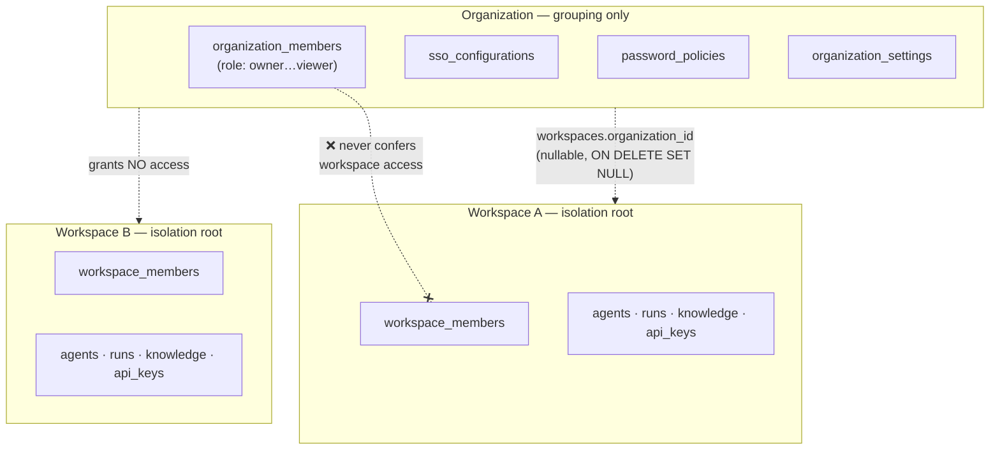

# Multi-tenancy and the organization/workspace model

How isolation actually works in AgentVerse, and — more usefully — what
is *not* an isolation boundary.

## The one boundary that matters

**`workspace_id` is the only tenant isolation root.** Every tenant-owned
table carries it, every query filters on it, every cache key and vector
search is scoped by it (Rule 11). Nothing else in the model isolates
anything.

Organizations are a **grouping layer over workspaces**, added for
billing rollup, SSO, branding and directory sync. They are deliberately
*not* a second isolation boundary, and the distinction is the single
most important thing on this page.

## Why organization membership grants nothing

This is ADR-0011, and it is what keeps the whole model additive.

If org membership implied workspace access, then attaching an existing
workspace to an organization would silently hand that organization's
members access to data they could not previously see. Attachment is an
administrative act — it must not be a privilege escalation.

Concretely:

- An **organization owner** with no `workspace_members` row has no
  access to any workspace in their organization. Not read, not list.
- Attaching workspace W to organization O requires **both**
  `require_org_role(ADMIN)` on O **and** `require_owner` on W. One
  handler, two independently resolved contexts. An org admin cannot
  absorb a workspace they do not own.
- Deleting an organization **detaches** its workspaces
  (`ON DELETE SET NULL`); it never cascade-deletes them. Losing a
  grouping must not lose the data.

## What is organization-scoped

Only things that are genuinely about the organization rather than about
any one workspace:

| Data | Why it belongs to the org |
|---|---|
| `organization_settings` | branding/identity of the org itself; never overrides a workspace's own |
| `sso_configurations` | identity federation is an org-level contract with an IdP |
| `password_policies` | applies to people, who belong to orgs, not to workspaces |
| `scim_tokens` | directory sync provisions org membership |
| `audit_logs.organization_id` | org-level events (e.g. `organization.created`) have no single workspace to attribute to |

Note the shape: every one of these is **configuration about identity**,
never workspace-owned domain data. No agent, run, knowledge base or API
key is ever reachable through the organization.

## The workspace ↔ organization link

`workspaces.organization_id` is a **nullable** FK with
`ON DELETE SET NULL`.

Nullable because most workspaces have no organization and never will —
the individual and Pro tiers do not need one, and making it required
would have forced a synthetic organization per user.

A single FK rather than a many-to-many link table because a workspace in
two organizations makes "which organization's SSO and password policy
apply here?" ambiguous, and there is no correct answer to give.

## Where isolation is enforced

Not in one place — in every layer, because a single choke point is a
single thing to forget:

1. **Dependency layer.** `get_current_workspace` resolves `workspace_id`
   from the authenticated identity and the path, then verifies
   membership. A workspace id from a request body or query string is
   never trusted (Rule 6).
2. **Query layer.** Every tenant table has a leading `workspace_id`
   index and every repository filters on it. Cross-workspace ids read as
   "not found" rather than "forbidden" — see below.
3. **Vector layer.** Similarity search is *pre*-filtered by
   `workspace_id`, never post-filtered on an unscoped top-k. Post-
   filtering both leaks and degrades recall.
4. **Cache/queue layer.** Redis keys are tenant-namespaced.

## 404 vs 403

- **404** — the resource belongs to another workspace or organization.
  Returning 403 would confirm it exists, which is itself a disclosure.
- **403** — the resource is in *this* workspace and the caller's role is
  insufficient. The caller already knows it exists, so the honest answer
  is "not allowed", and a 404 here would just be confusing.

Both are audit-logged from the enforcement point.

## What is deliberately not built

- **No cross-workspace queries.** There is no "list all agents in my
  organization" endpoint, because there is no role that can be granted
  it without breaking the invariant above.
- **No organization-level data plane.** The organization dashboard
  reports the *count* of attached workspaces and per-member sign-in
  activity. It never reports workspace contents.
- **No implicit workspace creation on org join.** Joining an
  organization gives you nothing until someone adds you to a workspace.
