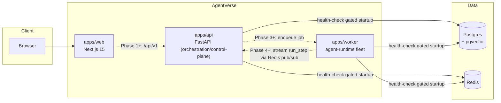

# Service Map

Owner: `principal-software-architect` / `microservices-architect` (`CLAUDE.md` §13: "cross-service flow diagrams (Mermaid, checked into the repo) are kept in sync... hand-drawn images that silently rot are avoided in favor of text-defined diagrams").

## Phase 0 state

Three services exist as health-check-only stubs; none calls another yet. Solid edges below are real (health-check dependency ordering enforced by `infra/docker-compose.yml`); dashed edges are the planned Phase 1+ data flow, not yet implemented — this diagram is a stub per `docs/roadmap.md` Phase 0's deliverable list, "to be filled in as services gain real boundaries."

## Reading this diagram

- **Solid arrows**: real today. `api` and `worker` both wait on `postgres` and `redis` reporting healthy before they start (Docker Compose `depends_on: condition: service_healthy`), even though neither consumes those datastores yet — the ordering is established now so Phase 1+ doesn't need to touch `infra/docker-compose.yml`'s dependency graph, only each service's own code.
- **Dashed arrows**: planned, not implemented. `apps/web` calling `apps/api`'s `/api/v1` gateway starts in Phase 1; `apps/api` enqueuing work for `apps/worker` starts in Phase 3; `apps/worker` streaming execution state back via Redis pub/sub (consumed by `apps/api`'s SSE endpoint) starts in Phase 4.

## Update policy

This diagram is updated in the same PR as any change to service boundaries or inter-service calls (`CLAUDE.md` §13) — never left to drift from what the code actually does.
