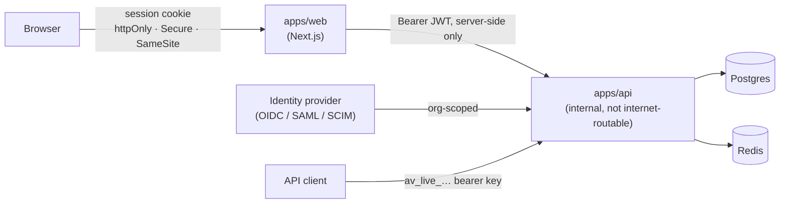

# Security architecture — enterprise workspace, organizations and identity

Covers what Phase 8 added: the seven-tier RBAC model, custom roles,
organization-scoped identity configuration, the Security Center
(security events, trusted devices, password policy, security score), and
API-key expiry.

Companion documents: [`rbac-matrix.md`](../architecture/rbac-matrix.md)
for the authorization model, [`multi-tenancy.md`](../architecture/multi-tenancy.md)
for isolation, [`threat-model-tool-execution.md`](threat-model-tool-execution.md)
for the agent-runtime surface.

## Trust boundaries

The browser never holds a token for `apps/api` and has no route to it.
That is why the audit export is served by a route handler in `apps/web`
that authenticates server-side and proxies — not by pointing a download
link at the API.

## Authentication

Unchanged from ADR-0005: Better Auth owns sign-in, Argon2id password
hashing, sessions, and 2FA. `apps/api` verifies a signed JWT and never
re-implements token parsing.

Phase 8 additions sit *around* that, never inside it:

- **Password policy** is organization-scoped configuration
  (`password_policies`, 1:1 with `organizations`). No row means the
  platform default applies — and the default is a real baseline
  (12 chars, mixed case, a digit), not "no rules".
- The table has a `CHECK (min_length >= 8)`. A policy feature that lets
  an organization drop *below* the platform baseline would make the
  product less safe than it is with the feature switched off, so the
  database refuses it even if the API schema were bypassed.
- **Forced expiry is off by default.** Periodic rotation is no longer
  recommended practice (NIST SP 800-63B); it is offered for
  organizations whose own compliance regime still mandates it.
- `password_violations()` returns **every** violation, not the first, so
  a user is not made to discover the rules one retry at a time.

## Authorization

See [`rbac-matrix.md`](../architecture/rbac-matrix.md). The security-relevant
properties:

- Deny by default, enforced server-side, in one shared dependency chain.
- `require_permission` composes *alongside* `require_role`, never
  replacing it — no pre-existing route changed meaning.
- Custom roles are **additive only**. A deny rule would break rank
  monotonicity, and every `require_role` floor depends on it.
- `workspace_id` always comes from the authenticated identity, never
  from client input.

## Security events

`security_events` is a **separate table from `audit_logs`**, and the
separation is deliberate rather than duplication:

| | `audit_logs` | `security_events` |
|---|---|---|
| Answers | "who did what in this workspace" | "what happened to this identity's security posture" |
| Scope | workspace (compliance record) | user; frequently no workspace, sometimes no user |
| Severity | none | info / warning / critical |

A failed login for an address matching **no account** must still be
recorded — dropping it blinds exactly the account-enumeration attempt it
evidences. That event has no user and no workspace, so folding it into
the workspace-scoped compliance log would mean adding a nullable
workspace to a table whose whole purpose is workspace attribution.

**Severity is derived from the event type**, never supplied by the
caller. Otherwise the same event lands at different severities depending
on which code path recorded it, and the feed stops being sortable by
urgency.

`event_type` and `severity` are TEXT + CHECK, not enums — same
reversibility reasoning as the role columns.

### Suspicious-activity detection

Implemented in the application layer (it is a *judgement* about a
pattern, not a storage concern), so it is testable against a fake:

- **Rapid failures** — 5 or more failed sign-ins for one identity within
  15 minutes escalates to a `critical` event. The window is deliberately
  short: widen it and ordinary "wrong password three times this week"
  starts alerting, which trains people to ignore the alert.
- **New-device sign-in** — a *successful* sign-in from a fingerprint the
  user has not confirmed. Successful-and-unrecognised is what account
  takeover looks like; an unrecognised failure is just noise.

## Trusted devices

Keyed on a caller-supplied fingerprint, **not on a session id**.
Sessions rotate on every sign-in, so keying on one would report every
sign-in as a new device — the exact false positive that makes people
stop reading the alerts.

- Unique per `(user_id, device_fingerprint)`; re-confirming updates
  rather than accumulating rows.
- Re-trusting a revoked device **un-revokes** it, rather than leaving a
  row that reads as trusted while still being refused.
- Revocation is scoped by `user_id` **in SQL**. A device id from another
  account reads as "not found" by construction, not by a separate
  ownership check that a future edit could drop.
- Revoking a device does **not** sign it out. That is the sessions
  panel's job, and the UI says so explicitly rather than letting the
  user assume otherwise.

## API keys

- `expires_at` is nullable; `NULL` means "never expires", which is what
  every key issued before Phase 8 does — deploying the migration
  invalidates no existing credential.
- Expiry is **enforced inside the authentication query**, not checked by
  callers afterwards. An expired key is therefore indistinguishable from
  an unknown one, and no future call site can forget the check.
- Issuance takes a **lifetime in days**, not an absolute timestamp: a
  client-supplied `expires_at` can be backdated, and a key that arrives
  already expired is a confusing failure rather than a useful one.
- **Rotation inherits the lifetime, not the timestamp.** Copying the
  expiry would mean rotating a 90-day key on day 89 hands back a key
  that dies tomorrow.
- `use_count` increments on each successful authentication, answering
  the question a bare `last_used_at` cannot: is this key still carrying
  real traffic?

## Security score

A 0–100 posture score with an explainable breakdown, computed by a pure
function (`compute_security_score`) so the weights are unit-testable
without a database.

| Factor | Weight | Why |
|---|---|---|
| Two-factor coverage | 40 | the single largest control against credential theft |
| SSO enforced | 20 | moves the trust decision to the customer's IdP |
| Password policy configured | 15 | a deliberate choice, not the default |
| IP allowlist configured | 10 | only meaningful for fixed-location teams |
| API keys expire | 10 | penalty — something actively wrong |
| No critical events in 30 days | 5 | penalty — recent evidence of a problem |

Design decisions worth stating:

- **Two-factor is proportional**, not all-or-nothing, so a rollout shows
  visible progress instead of scoring zero until the last person
  finishes.
- **An empty workspace is not penalised.** Zero members means zero
  uncovered members; scoring it as 0% coverage would tell a brand-new
  workspace it has a problem it cannot act on.
- **Every factor carries a remediation string** when it loses points. A
  bare number tells an admin they have a problem without telling them
  which one.
- The score is asserted to equal the sum of its factors — a score the
  breakdown cannot explain is one nobody can act on.
- A workspace with no organization simply cannot earn the SSO and
  password-policy points. That is not an error and is not scored as if
  the controls were configured.

## Audit export

- Bounded at 10,000 rows. `audit_logs` is append-only and unbounded; an
  unlimited export is a denial-of-service against this service's own
  memory.
- **CSV formula injection is neutralised.** Audit values include
  user-controlled text (targets, metadata). A cell beginning `=`, `+`,
  `-` or `@` is executed as a formula by spreadsheet software, so an
  exported audit log is a real code-execution path unless the value is
  prefixed. It is neutralised, not stripped — the original text stays
  readable to a reviewer.
- Served as `text/csv` (not a spreadsheet MIME type) with
  `Content-Disposition: attachment` and `X-Content-Type-Options:
  nosniff`, so attacker-influenced content is never rendered as a
  document in this origin.
- Column order is fixed and declared, not derived from dataclass field
  order — someone's script parses it, and a field reordering must not
  silently reshape it.
- Authorization is **not** re-implemented in the `apps/web` proxy route.
  `apps/api` gates the export on `require_admin` and the proxy forwards
  the upstream status; a second copy of the check is a second thing to
  drift.

## Known gaps

Stated rather than implied:

- **Presence is session-derived, not live.** `has_active_session` means
  "holds an unexpired session". There is no heartbeat anywhere in the
  system, so the UI says "signed in", never "online".
- **Password policy is enforced at the API boundary** (`/password-policy/check`
  and on policy-governed changes). Better Auth owns the sign-up and
  password-reset flows in `apps/web`; wiring the org policy into those
  flows requires resolving the user's organization at sign-up time,
  which is a separate change and is not claimed here.
- **`max_age_days` is stored and surfaced but not yet enforced** — there
  is no job that expires a password on schedule. The field is honest
  configuration for organizations that need to record the policy; the
  enforcement job is not built.
- **Device fingerprints are client-supplied and unverified.** They
  identify a device for alerting purposes; they are not an
  authentication factor and are never treated as one.
