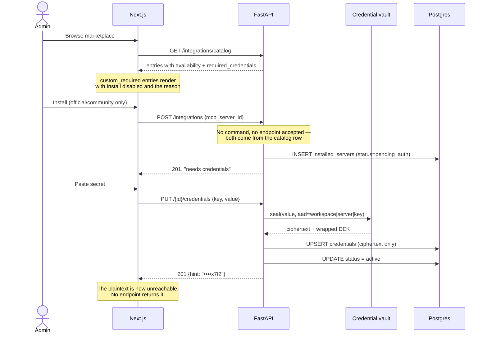
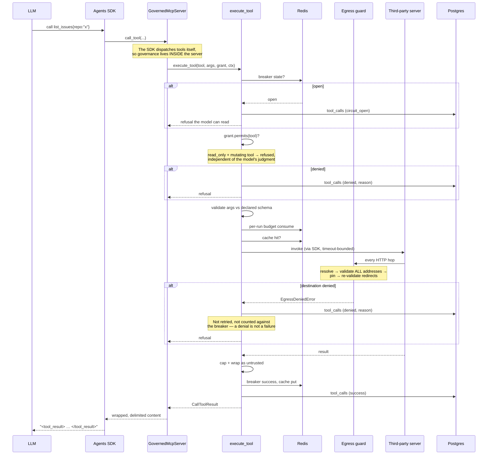
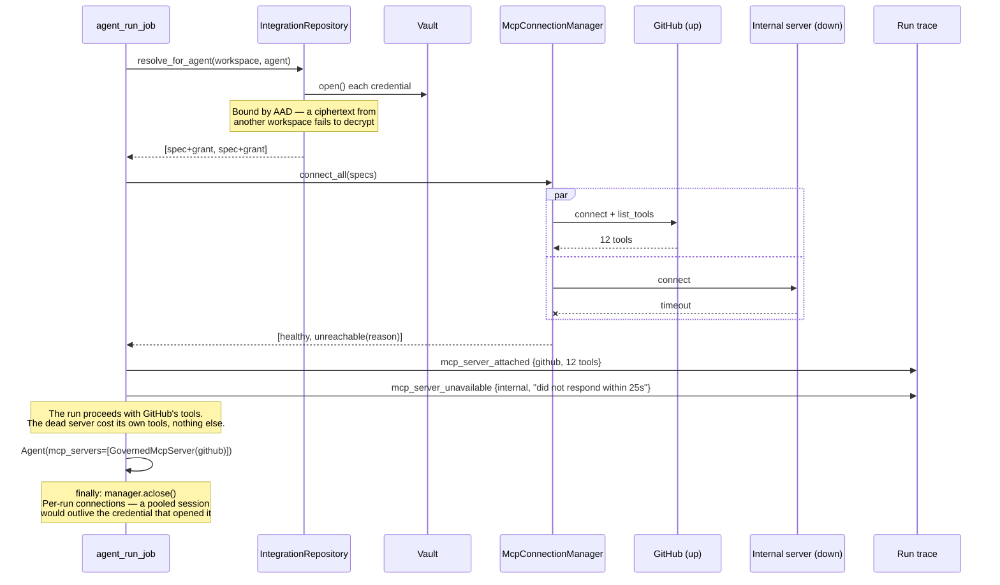
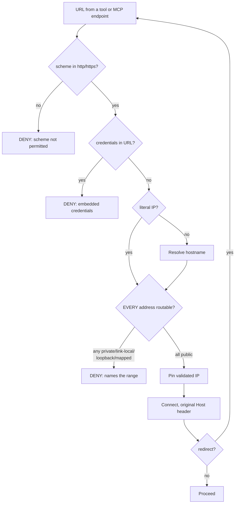

# MCP Flows — Authentication, Tool Execution, and Runtime

Sequence diagrams for the three flows in Phase 6 whose ordering carries
security weight. Companion to
[mcp-integrations.md](./mcp-integrations.md) (the architecture) and the
[threat model](../security/threat-model-tool-execution.md).

## 1. Install and authenticate

**Why `pending_auth` rather than `active`:** an integration that looks
ready and fails on first use is worse than one that says what it needs.
The status flips automatically when the credential lands — making the
admin flip a second switch would be ceremony.

## 2. Tool execution

The ordering is the design. Each step is cheaper than the one after it,
and each can only be reached by passing the ones before.

**Every branch writes a row.** A blocked SSRF attempt that left no trace
would make the egress control unauditable, which is most of its value.

**Refusals return, they do not raise.** An agent told *why* a tool was
refused can choose another approach; an exception ends the run.

## 3. Run-time attachment and degradation

This is the phase's acceptance criterion made concrete: *a failing MCP
server disables only its own tools for that run, with a clear trace
event — it never crashes the run.*

## 4. Egress validation

The part that is easy to get subtly wrong.

Three properties, each closing a real bypass:

| Property | Bypass it closes |
| --- | --- |
| Validate **every** resolved address | A hostname with one public and one private A record |
| **Pin** the validated IP | DNS rebinding — the second resolution inside the HTTP client |
| Re-validate **each redirect hop** | `302 → 169.254.169.254`; MCP's client follows redirects by default |

Unwrapping `::ffff:169.254.169.254` and `2002:a00:1::` matters for the
same reason: the metadata address wearing a different hat is still the
metadata address.
